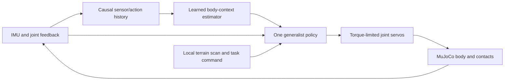

# General control under changing leg geometry and function

September 10, 2026 UTC. Engineering plan and gap review; proposed dimensions, budgets and acceptance criteria are not measured results. User intent is captured in [BRIEF.md](BRIEF.md). No adaptive Go2 policy, damaged-body environment or new video has been implemented.

## The experiment

One deployed controller receives sensor history and a task command, infers useful information about its current body, and changes its actions to maintain progress. Train over continuously varied leg geometry and function, then evaluate withheld severities, combinations and courses. The experiment should establish what recent interaction contributes beyond ordinary randomized training.

First prove local obstacle traversal with partial damage. Later add learned route selection through a branching course. A velocity command or scripted waypoint follower does not itself demonstrate autonomous route choice.

The existing amphibious Go2 gait remains a separate scripted demo. Its robot assets, scene composition and recording conventions are useful; its gait controller and floats are not part of this policy.

## What exists, and what does not

| Component | Evidence or gap | Implementation decision |
| --- | --- | --- |
| CPU simulation throughput | Our isolated mjbatch audit passed 38 upstream tests and collected 7.23 million control transitions in a 60-second Go1 PPO run. | Start with mjbatch, then measure our full contact model and history policy. The old throughput is not a parkour estimate. |
| Go2 physical model | The committed Menagerie model has 12 actuators; the earlier audit measured 15.206408 kg total mass. | Preserve vendor sources. Generate derived bodies and record their individual mass/inertia manifests. |
| Partial damage | No procedural generator or validated stump contacts exist. | This is the first implementation milestone, including shortened calf geometry. |
| Adaptation | No history-conditioned Go2 controller exists here. | Build a small causal encoder and generalist policy with a privileged training reference. |
| Environment and evaluation | No Go2 RL API, terrain curriculum or damage test matrix exists. | Implement observation, action, reset, transition, termination and evaluation contracts before training. |
| GPU benefit | The 4090 training machine is available; mjbatch physics remains on CPU. | Measure complete rollout-plus-update throughput on both machines. Do not infer a GPU speedup from its model name. |

The August 2026 [Rapid Embodiment Adaptation paper](https://arxiv.org/html/2608.01506v1) is a close architectural reference: a generalist policy plus history-based estimation of hardware properties. It evaluates joint restrictions and trunk mass, uses IsaacLab/PPO, and reports 147 million offline timesteps for its adaptation dataset. Its short response time is not its training time. Partial amputation and parkour are outside its demonstrated setting. The [project page](https://embodiment-adaptation.github.io/) links the paper and videos; we have not obtained a training release from it. Our design would be an independent extension, not a reproduction claim.

## Physical body generation

Define a serializable `BodySpec` with independent geometry, actuation and sensor fields. Keep the distinction between a shortened member with a terminal contact surface, loss of the foot pad, loss of a distal joint, an unpowered but present member, and a locked member. A shortened leg with a replacement rubber foot is another explicit condition, not the default meaning of damage.

| Variation | Initial development range | Later coverage |
| --- | --- | --- |
| Remaining calf length | 60–100% of nominal, one independently selected limb | 20–100%, multiple limbs, plus explicit absent-segment templates |
| Upper leg geometry | Nominal initially | Shortening and distal assembly removal; preserve the correct joint chain for each case |
| Motor strength | 50–100% of nominal | 0–100%, mixed weak joints, time-varying strength |
| Available joint travel | 50–100% of nominal span about a sampled valid center | Narrow travel, physically modeled locking and different lock angles |
| Actuation latency | Nominal initially | 0–60 ms command delay and intermittent dropout |
| Ground conditions | Moderate, fixed friction for initial fault isolation | Friction/noise variation mixed with damage, including fault-versus-slip tests |

These are curriculum ranges to validate, not Go2 capability specifications. Keep healthy cases throughout training and sample body conditions deliberately so easy cases do not dominate.

Use `MjSpec` composition and compilation for structural changes. MuJoCo supports adding/removing model elements through its [model editing API](https://mujoco.readthedocs.io/en/stable/programming/modeledit.html). Start by compiling a cache of sampled geometry variants before rollout. Shorter geometry needs updated downstream frames, collision bounds, terminal surfaces and inertia; `geom_size` edits alone are insufficient. Do not assume `set_const` recomputes every geometry/compiler artifact. Any later in-place optimization must match separately compiled reference models in dynamics and contact tests.

For changed segments, use explicit primitive collision/visual geometry and a documented approximate mass distribution. Separate retained joint housing from removable link material; derive composite center of mass and inertia rather than scaling every quantity by the remaining length. Vendor aggregate inertias do not reveal the true internal distribution after a cut. Preserve unaffected vendor properties and perform sensitivity tests on the changed-segment approximation. This is a simulation of damage, not a calibrated structural fracture model.

Each batch has fixed topology. Initially use several cached models and rotate them between rollout blocks, collecting a balanced mix for one policy. Removing joints requires separate models; a stable 12-slot semantic policy interface maps to the surviving actuators. Limit total worker threads across batches to avoid oversubscription. Many tiny batches and geometry compilation can erase mjbatch's speed advantage, so profile this before expanding the variant count.

Keep full meaningful trunk, leg and stump contact geometry, with documented adjacent-link exclusions. A remaining stump can support the robot. Fixed four-foot contact rewards and foot-only collision are inappropriate. Record trunk contact and impacts; do not terminate merely because a shortened body sits below the healthy standing height.

Initial physics: 2 ms `implicitfast`, 50 Hz policy updates. Start with torque-clipped position PD (`Kp=20 Nm/rad`, `Kd=0.5 Nm s/rad`) as provisional gains. Commands are nominal-angle offsets bounded by a fixed documented action scale, not a prerecorded gait. Compose native MuJoCo position servos with unit joint gearing and explicit force limits: nominal hip/thigh ±23.7 Nm and calf ±45.43 Nm from our committed model. Their command ranges are in radians; the original motor command ranges were torque limits and must not be copied as position ranges. Degradation can only reduce available torque. Distinguish modeled passive brake reactions from actuator torque when testing a locked joint. A passive lock is not an unlimited motor.

The [native position servo](https://mujoco.readthedocs.io/en/stable/XMLreference.html#actuator-position) supports position gain, velocity damping and force clamping, keeping feedback inside every physics step. A Python per-environment callback or holding one stale torque for ten substeps changes the intended controller and can destroy throughput. Verify strength changes against scalar stepping; zero available motor strength must also remove active servo damping while retaining documented passive joint friction/damping. Initially implement delay in per-environment command buffers at control-step resolution and label that resolution. Native delay requires a separate check that batch state preservation includes its history.

Geometry is fixed within initial episodes. Motor weakening/dropout can occur during an uninterrupted run. Sudden restrictions should engage at physically consistent positions through a modeled brake/stop rather than instantly moving joint limits through the current state. Actual detachment during a run would require a release mechanism and physically retained debris; changing models or deleting mass is not a fracture simulation.

## Sensor, memory and action contract



Deployment actor inputs: joint angles/velocities in fixed nominal units, gyro and an IMU-style orientation estimate, prior issued actions, timestamps/validity for sensor channels, and a causal local terrain scan plus task command. Model noise and latency progressively. Optional motor-current-derived torque feedback must be labeled as a simulated sensor. Do not require instrumented foot contacts that disappear with the foot. Exact base velocity, contact forces and damage settings belong to the training critic/debugger unless an explicit sensor model supplies them.

Missing sensor channels carry validity information a real controller could receive. Keep sensor validity independent of motor strength and segment length: a shortened calf can retain a working encoder, and an intact motor can suffer communication loss. Padding or normalization must not expose the true remaining geometry or hidden force limit. Fault onset does not reset history or send a failure flag.

Start with 25 samples at 50 Hz (0.5 s), compare 10 and 50 samples. A compact causal temporal encoder produces a small task-relevant body context; a shared MLP produces joint targets. This is an initial engineering choice, not a claim that this architecture is optimal. Fixed limb identities do not impose symmetric actions. Defer graph/attention architectures until there is evidence that the compact version cannot represent the task.

Not all physical parameters are identifiable from a short trajectory: weak actuation, altered leverage and low friction can look alike. Learn a control-relevant context and optionally predict selected observable properties; avoid claiming exact fault diagnosis. An auxiliary next-observation prediction loss can test whether the context improves prediction of the robot's response. Prediction error is a diagnostic, not automatically calibrated uncertainty.

Use a finite-field, body-mounted ray scan at a separately logged sensing rate, initially 20 Hz, with actual collision intersections, range limits and missing-return masks. Freeze its layout before comparisons. This is simulated range sensing, not RGB computer vision or privileged sampling of every terrain height under the robot. Head-camera RGB remains observer output in the first version.

The batched sensor path is a performance gap: native rangefinder sensors can expose results through batched sensor arrays, but may compute more often than the desired observation rate. Benchmark a small beam set first and distinguish sensing computation from 20 Hz delivery. Do not add Python loops that raycast each environment without measuring their cost.

## Training sequence and optimizer choice

1. **Train a privileged reference.** An encoder sees the sampled physical description; one policy learns useful actions over the body family. An asymmetric critic may see simulator truth. Success establishes a learned reference with known body information, not an upper bound on physical feasibility.
2. **Train the history estimator.** Collect trajectories including disturbances and fault transitions; train the sensor-history encoder to supply a useful context, using reference contexts and response prediction as candidate supervision. Split by body/scenario, not overlapping adjacent windows.
3. **Close the estimator/control loop.** Gradually replace true context with predicted context during training, collect the resulting failures, and fine-tune the deployed path. A policy trained only on perfect descriptors may fail on the estimator's errors.
4. **Expand terrain and combinations.** Add partial geometry and single-function changes early; then mixed damage and progressively harder terrain. Maintain healthy-case sampling and evaluate every stratum.
5. **Optional weight-changing adaptation.** Separately compare no updates, fine-tuning and fresh training for a newly withheld body at 1/3/5-minute budgets. Name this additional simulation training. It does not establish adaptation on hardware from a single real trajectory.

mjbatch selects the execution backend, not the learning algorithm. Keep two trainer slots: the already-audited PPO implementation as a diagnostic baseline, and a current off-policy challenger. [FlashSAC](https://github.com/Holiday-Robot/FlashSAC) and [WarpSAC](https://github.com/wzhhasadream/warprl) are candidates; WarpSAC extends FlashSAC and its reported results use JAX. Their published installation stacks are not a drop-in mjbatch/macOS integration. Audit the smallest learner/environment adapter and current dependencies before selecting the challenger. Do not install a legacy simulator just to run an unrelated wrapper.

Run matched short pilot budgets on healthy and mildly damaged bodies, using the same observations, actuator model, reward and seeds. Select by success per wall-clock budget, stability, memory and integration cost. Keep the selected optimizer fixed for the adaptation ablations. A newer algorithm's name is not evidence of better performance on this task.

For off-policy training, store raw causal sequences and episode boundaries, not permanently cached contexts from an obsolete encoder. Recompute contexts when sampled; include actual next observations before auto-reset and correct termination/truncation bootstrapping. Do not blend hidden states across robots. Sequence storage, device transfer and update-to-data ratio need explicit memory/throughput budgets.

Start around 256–1,024 environments total, profiling body compilation, simulation, observation/history assembly, inference, transfer and learning separately. Record first-build/JIT time independently and include startup in end-to-end time-to-result. The measured 60-second flat-ground example is the existing result; minutes-scale generalist training is still a hypothesis.

## Course and reward progression

| Stage | Task and proposed initial dimensions | Evidence needed to advance |
| --- | --- | --- |
| A | Flat 5 m lane; stand, move and turn | Healthy motion plus meaningful progress under one shortened calf and one weakened actuator |
| B | Isolated 2–10 cm steps, ramps up to 10 degrees | Same controller adapts approach/stance across geometry and damage without gait selection |
| C | Held-out sequences; steps up to 18 cm and short 5–25 cm gaps as development targets | Physical clearance/landing and recovery across task and damage combinations |
| D | Branching course with step, gap and longer ramp routes | Goal-conditioned policy chooses route from sensing; no hidden scripted branch selection |
| E | Severe multiple faults, two-/one-leg limits and larger obstacles | Exploratory capability map, including retained failures; no blanket completion target |

Keep isolated mandatory obstacles as evaluation tasks even after detours are available. Otherwise a robot could avoid all difficult terrain and appear to have improved parkour. Raise dimensions only after contact and torque evidence supports it.

Reward bounded goal progress and completion, with modest time, effort, high-impact and excessive action-change costs. Avoid mandatory gait phase, bilateral action tying, universal healthy-body height, four-foot air-time targets, and roll/pitch penalties that prohibit useful climbing. Prevent reward loops through repeated back-and-forth progress. Distinguish useful low posture or brief support contact from damaging impacts and prolonged sliding. Numerical failure, unrecoverable fall, off-course movement and time limit get separate outcomes.

## Evaluation and proposed acceptance criteria

Freeze train/development/test generators and body/terrain manifests before tuning. New random seeds alone do not prove new damage: reserve severity intervals, multi-fault combinations and an entire failure mechanism as separate tests. Report interpolation, extrapolation, unseen combinations and unseen mechanisms separately. Failure on the last category is plausible and must remain visible.

Compare: healthy-only policy; randomized memoryless policy; history-conditioned policy without explicit context supervision; proposed estimator-conditioned policy; and privileged reference. Match training budget/inputs and approximately match network capacity for the causal ablations. Disabling the estimator or freezing its context is an additional diagnostic, not a substitute for a trained robust baseline.

Proposed first acceptance gates, to lock before training:

- At least 90% healthy completion on a 5 m lane with a 20 s deadline across 100 development starts.
- At least 80% completion on the mild partial-damage lane/low-step set across three independent training seeds and 100 fixed trials per damage family per seed. Report each family, not only the pooled average.
- Target at least a 15 percentage-point completion advantage over the randomized memoryless baseline, with healthy completion degrading by at most 5 points. Report paired differences, confidence intervals and seed-level variation; a target is not a promised result.
- Record recovery latency after a known fault event, conditional on actual recovery, together with the fraction that never recovers. A proposed recovery criterion is five seconds of renewed task progress without falling; timestamp its start only after the sustained interval is observed. Do not report encoder latency as locomotion recovery.
- Zero hidden resets/pose corrections, applied torques within documented limits, and no accepted numerical warnings. Inspect penetration/impact distributions and repeat decisive evaluations at a finer physics timestep and stronger solver settings to test simulator exploitation.

Completion requires reaching the destination region within the deadline and remaining controlled for one second; it does not require a healthy standing pose. Record all attempted runs, falls, time/distance, peak impacts, support contacts, energy and saturation. A failed privileged policy does not prove the body cannot move; label feasibility unresolved unless supported by a separate mechanical argument.

## Implementation layout and reproducibility

Proposed new isolated uv project (paths and CLI do not exist yet):

```text
experiments/adaptive_locomotion/
  pyproject.toml, uv.lock
  src/adaptive_locomotion/
    bodies.py       # BodySpec, compilation, inertias, semantic maps
    actuation.py    # servo/weakness/delay/brake model
    terrain.py      # obstacle and sensor geometry
    env.py          # scalar reference environment
    batch.py        # mjbatch adapter and variant scheduler
    observations.py # sensor clocks, masks, history, leakage boundary
    policy.py       # context encoder and shared controller
    train.py        # trainer interfaces, curriculum, checkpoints
    evaluate.py     # frozen cases, ablations, physical metrics
    record.py, cli.py
  tests/
docs/locomotion/
assets/locomotion/   # selected checkpoints/manifests, Git LFS
previews/locomotion/ # selected review images and final videos, Git LFS
outputs/locomotion/  # ignored rollouts, logs, model cache
```

Reuse licensed robot assets and existing rendering/launcher patterns without changing approved scenes. The root project currently excludes Python 3.14; the separate uv project avoids forcing a dependency migration of the completed demos. Our last isolated working stack was uv 0.12.12, Python 3.14.7, MuJoCo 3.13.0 and PyTorch 2.14.0. Recheck current releases at implementation, pin a tested set, and commit any necessary reproducible mjbatch build-pin patch with attribution. A temporary checkout is not a reproducible dependency.

Implement a scalar reference environment before optimizing batches. Check identical initial states and action sequences through scalar and batch stepping, including per-world faults, history reset, sensor timing and early termination. The observation packer must produce identical deployable observations when only private damage labels are changed. Separately test sensor outages and missing-actuator mappings.

Record source commit, dependency versions, model/scenario hashes, seeds, actual physics/control/sensor clocks, all trainer settings, checkpoints and evaluation manifests. Synchronize through commits/LFS; keep machine-specific access details out of Git. Run Linux CUDA/Mac CPU or MPS inference agreement checks and a native macOS viewer smoke test. Compare task metrics across backends rather than demanding identical long chaotic trajectories.

## Delivery order and gaps that can change the plan

| Milestone | Concrete deliverable | Main unresolved issue / response |
| --- | --- | --- |
| 1. Bodies and static course | Healthy, short-calf, absent-distal-part and weakened-joint previews; physical manifests | Approximate damage inertia and terminal contacts: inspect and validate before movement. |
| 2. Environment correctness | Scalar/batch transition agreement and full-contact throughput report | Topology batching and substep servo cost: profile before a large curriculum. |
| 3. Generalist reference | One trained policy works with known body context on simple tasks | If it cannot move, estimator work cannot repair its missing motor skill; fix training/task first. |
| 4. Sensor-only adaptation | Same policy runs on estimated context; matched ablation report | Partial observability and estimator/control mismatch: test history, response prediction and closed-loop training. |
| 5. Unseen obstacles and faults | Frozen evaluation suite, success matrix and recovery curves | Damage combinatorics and reward shortcuts: balanced curriculum and independent held-out tests. |
| 6. Full video | Overview/follow/leg-detail/head views, synchronized comparisons and provenance | Select cases before final testing; retain failures and disclose camera inputs, training budgets and playback rate. |

The first complete video should include a clearly visible partial-leg geometry case, a continuous run with actuation degradation, and matched baselines. Use one deployed checkpoint for the generalist claim. Show measured task outcomes rather than an uncalibrated body-estimate confidence gauge. Additional fine-tuning gets a separate labeled segment with actual training time.

The most important open decision is empirical: can a small controller trained with realistic partial-body contacts reach useful performance at our desired iteration speed? Milestones 1–3 answer that before expensive perception, route planning or elaborate detachment mechanics are added.
